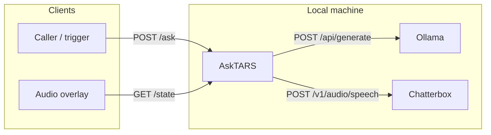
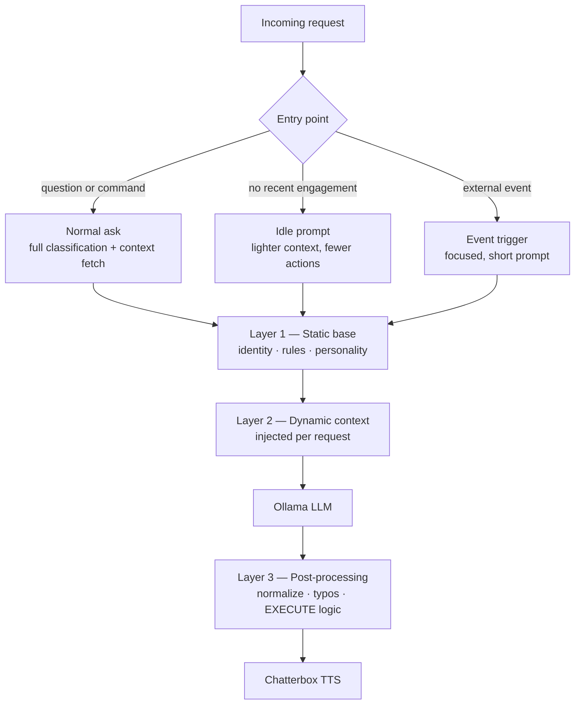
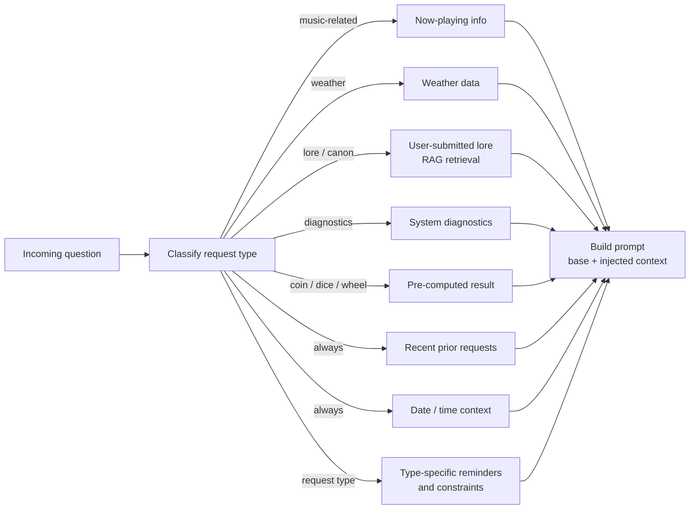
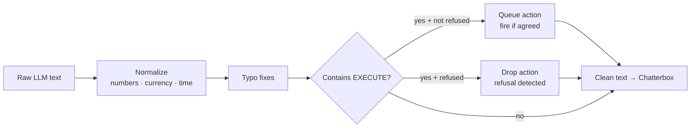
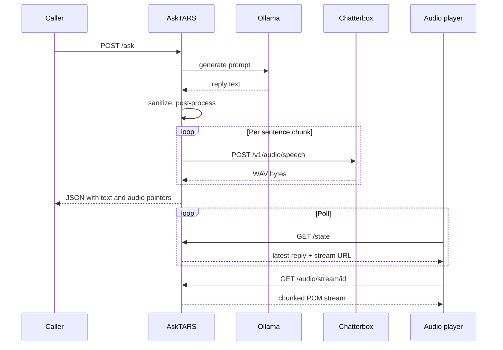
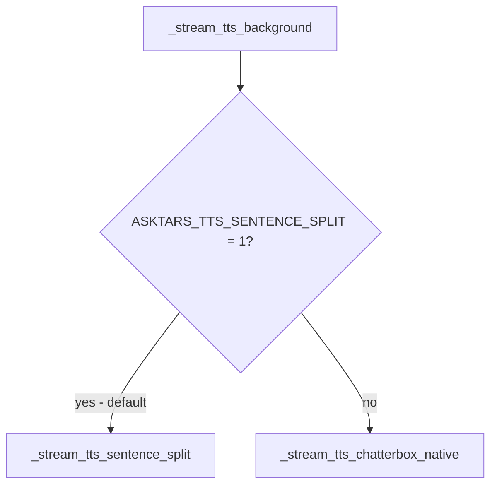
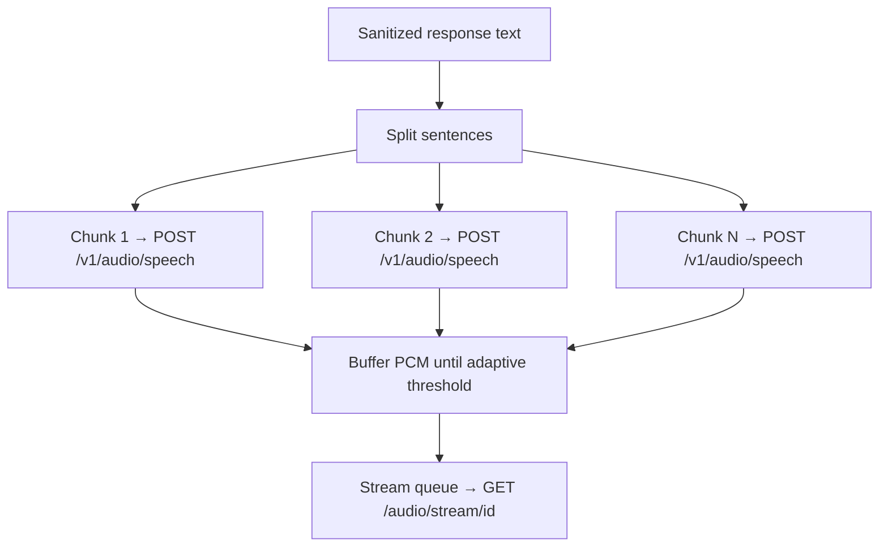

# OpenTARS
A home assistant project based on the robot from Interstellar

# AskTARS

A locally-run personal assistant with a voice. You ask something in natural language; a few seconds later a spoken reply comes back. No cloud services. No API keys. Everything runs on the machine.

---

## How it works — the short version

Three separate processes talk to each other over HTTP:

| Process | Role |
|---------|------|
| **Ollama** | Large language model — produces the text reply |
| **Chatterbox** (`tts_server.py`) | Neural TTS — turns text into WAV audio |
| **AskTARS** (`main.py` / uvicorn) | Orchestration — prompt assembly, LLM calls, TTS pipeline, audio streaming |

AskTARS never imports the others as libraries. It only talks to them over HTTP. Environment variables (`OLLAMA_BASE_URL`, `CHATTERBOX_BASE_URL`, `ASKTARS_PORT`) override the default ports.

---

## How I think — prompt layering

Every response starts as text, shaped by a layered prompt system before the LLM ever sees the question. The full pipeline looks like this:

### Entry points

The same pipeline runs for all three, but the prompt shape is different each time:

- **Normal ask** — a question or command comes in. Full request classification and context-fetching runs before the prompt is built.
- **Idle / boredom** — no recent engagement; TARS speaks up unprompted. Lighter context, different allowed actions.
- **Event trigger** — an external event arrives (e.g. a visitor). Focused, short prompt with a specific goal.

### Layer 1 — Static base

A fixed system prompt defining identity, personality, rules, and what TARS will and won't do. Identical for every request. Not published here.

### Layer 2 — Dynamic context (injected per request)

Before the LLM sees the question, `main.py` classifies it and fetches only the context that's relevant. Each injection is conditional — most questions trigger only a small subset.

### Layer 3 — Post-processing

After Ollama responds, the text is normalized before it reaches Chatterbox.

If the request was refused anywhere in the response, no action fires even if `[EXECUTE]` appears in the text.

---

## End-to-end: from question to voice

The caller (whatever triggered the question) and the audio player are **separate clients**. The caller gets JSON back. The audio player independently polls `/state` to find out what to play and where.

---

## What Chatterbox actually implements

Chatterbox is a small **FastAPI** app (`tts_server.py`) with two audio endpoints:

- **`POST /v1/audio/speech`** — returns a full WAV in the response body. This is what sentence-split streaming uses: one call per sentence chunk.
- **`POST /v1/audio/speech/stream`** — Chatterbox generates a full WAV then streams it back in chunks. Used only when `ASKTARS_TTS_SENTENCE_SPLIT=0`.

The request body requires at least `input` (text to speak). Optional `exaggeration` and `cfg_weight` tune delivery style. Model inference runs in a **thread pool** so the async server doesn't block during GPU work.

Each `generate` produces a full utterance WAV in memory — there is no true phoneme-level stream from the model. "Streaming" is either AskTARS scheduling many short generations (sentence-split mode) or Chatterbox chunking one long generation over HTTP (native mode).

---

## Streaming modes

`main.py` routes TTS through `_stream_tts_background`, which branches on `ASKTARS_TTS_SENTENCE_SPLIT` (default: on).

### Sentence-split adaptive streaming (default)

`_stream_tts_sentence_split` — **not** one Chatterbox call per reply.

1. **Split** the response text with `_split_sentences`: breaks on `.` `!` `?` (ellipses protected), merges short fragments, ensures each chunk ends with punctuation before TTS.
2. **Generate** each chunk via a separate `POST /v1/audio/speech`. Bad audio triggers `_audio_is_bad` and a retry.
3. **Adaptive pre-buffer**: accumulated playback duration must reach ≥ 1.2× estimated remaining generation time before the audio player hears anything. When threshold is met, AskTARS sends one WAV header plus buffered PCM to the stream queue; further sentence PCM is pushed as it's ready.
4. **Disk**: the full reply is also written to a single WAV file for archival / fallback.

### Native Chatterbox streaming (sentence-split off)

When `ASKTARS_TTS_SENTENCE_SPLIT=0`, AskTARS sends the full text in one HTTP streaming `POST` to Chatterbox's `/audio/speech/stream` endpoint. Chatterbox returns chunks; AskTARS forwards them to the same queue. This skips the adaptive sentence-split loop entirely — different tradeoffs.

### Non-streaming

When TTS streaming is disabled, AskTARS calls `get_tts_wav` and serves static WAV files from `audio_out/` instead of `/audio/stream/...`.

---

## Startup

On startup, the `lifespan` hook POSTs a short phrase to Chatterbox so the first real request doesn't pay full model-load latency. If Chatterbox isn't up yet, AskTARS retries with backoff — non-fatal, but both services should be running before use.

---

## Configuration

| Variable | Purpose |
|----------|---------|
| `OLLAMA_BASE_URL` | Where AskTARS finds Ollama |
| `CHATTERBOX_BASE_URL` | Where AskTARS finds Chatterbox |
| `ASKTARS_PORT` | Port AskTARS listens on |
| `CHATTERBOX_N_CFM_TIMESTEPS` | Set in Chatterbox's environment; fewer steps = faster, more risk of audio artifacts |
| `ASKTARS_CHATTERBOX_STREAMING_QUALITY` | `fast` / `balanced` / `high` — affects buffering behaviour |
| `ASKTARS_TTS_STREAMING` | Master switch for streaming TTS |
| `ASKTARS_TTS_SENTENCE_SPLIT` | `1` = sentence-split adaptive mode (default). `0` = native Chatterbox stream. |

Defaults live in `config.py`. Chatterbox reads its own timestep defaults from its environment in `tts_server.py`.

---

## Known issues

- If Chatterbox is down, AskTARS can still return text; audio endpoints fail or hang depending on path.
- **Hallucinated words** at the end of a sentence can come from the TTS model, not from the LLM output. Mitigated by sentence boundaries and short-fragment merging; not fully preventable.
- **Incorrect contextual information** in a reply is an LLM failure, not a Chatterbox one. Chatterbox only speaks what it's given.

---

*No poetry. No tiny hats.*

