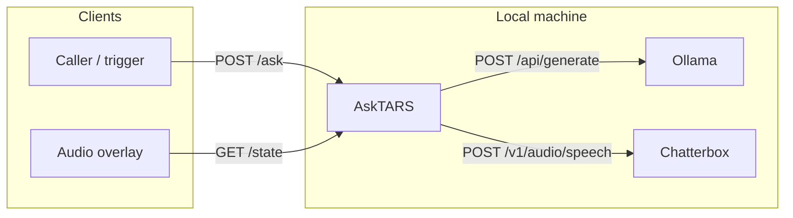
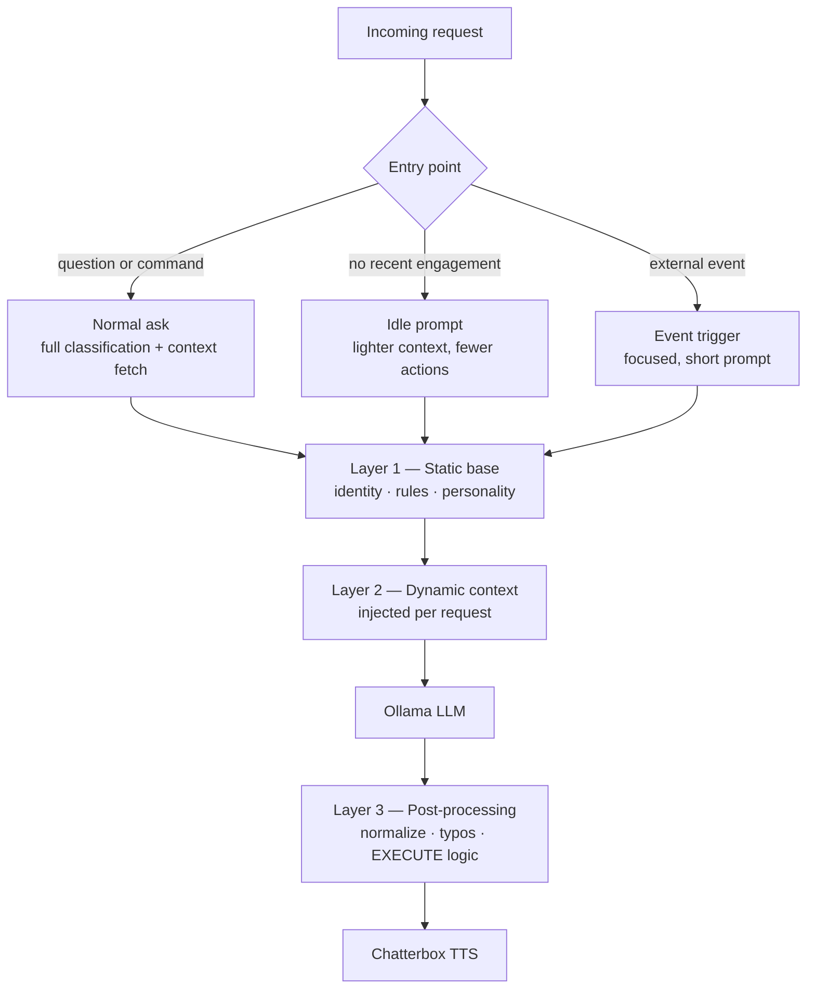
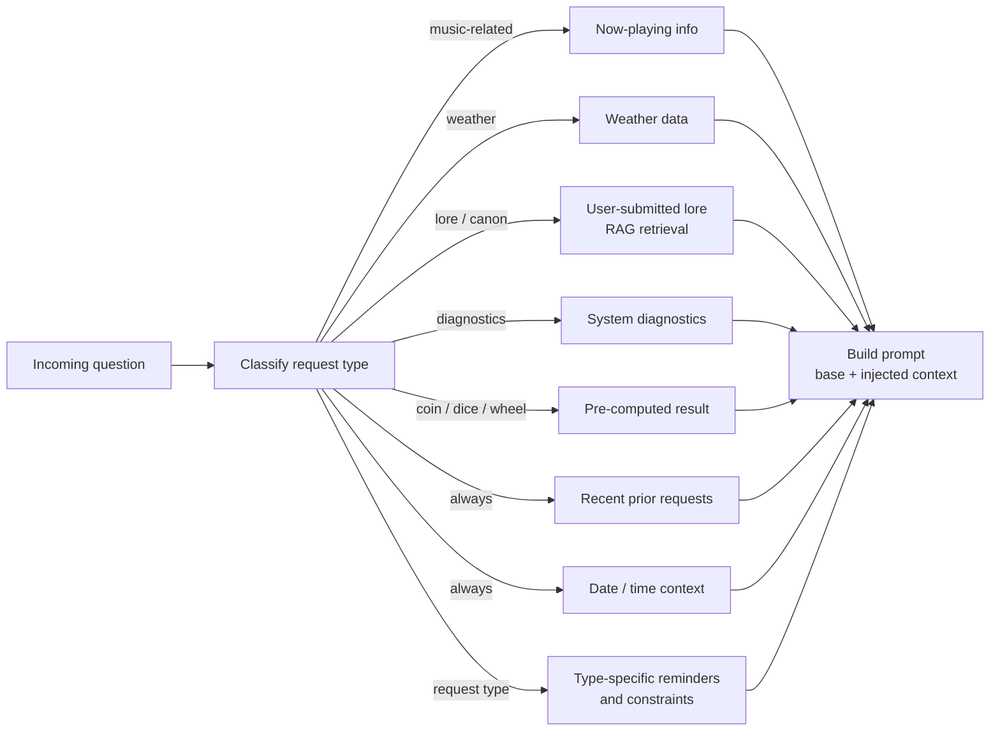
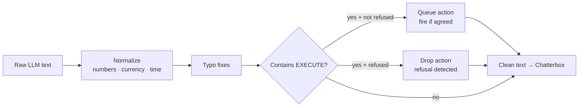
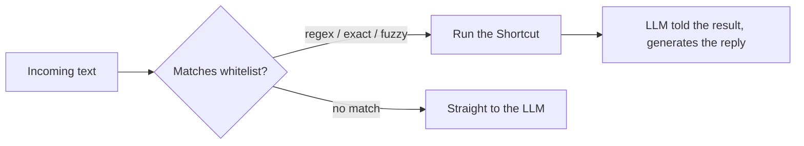
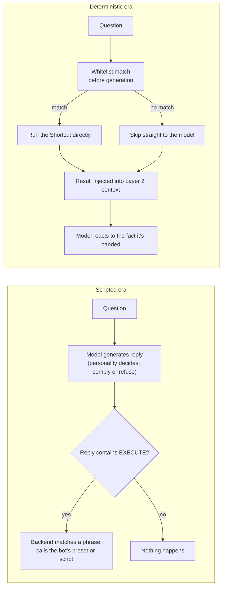
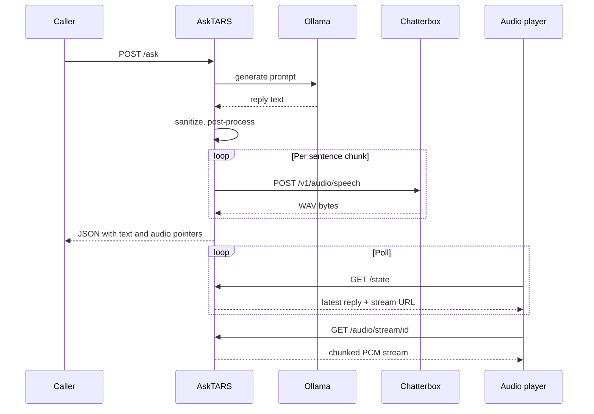
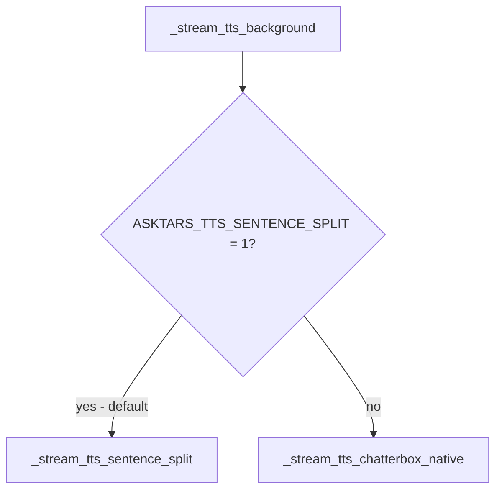
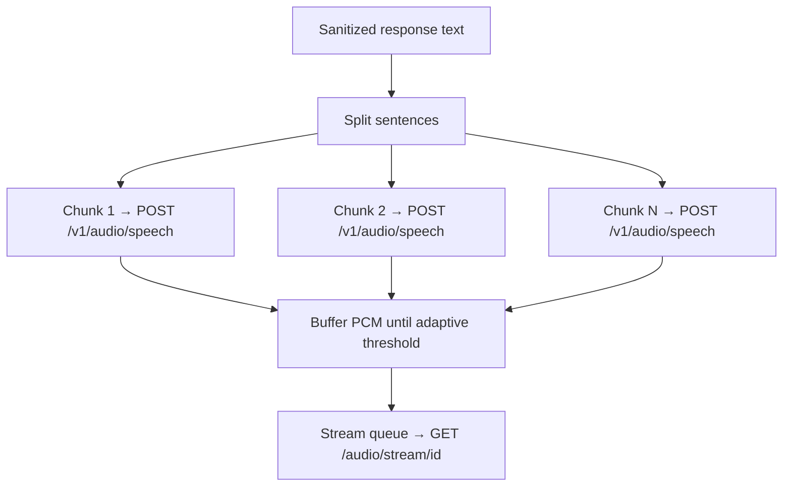
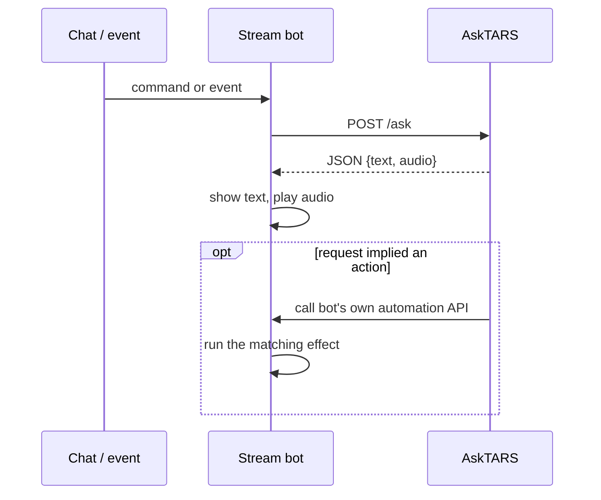

# OpenTARS
A home assistant project based on the robot from Interstellar

# AskTARS

A locally-run personal assistant with a voice. You ask something in natural language; a few seconds later a spoken reply comes back. No cloud services. No API keys. Everything runs on the machine.

---

## How it works — the short version

Three separate processes talk to each other over HTTP:

| Process | Role |
|---------|------|
| **Ollama** | Large language model — produces the text reply |
| **Chatterbox** (`tts_server.py`) | Neural TTS — turns text into WAV audio |
| **AskTARS** (`main.py` / uvicorn) | Orchestration — prompt assembly, LLM calls, TTS pipeline, audio streaming |

AskTARS never imports the others as libraries. It only talks to them over HTTP. Environment variables (`OLLAMA_BASE_URL`, `CHATTERBOX_BASE_URL`, `ASKTARS_PORT`) override the default ports.

---

## How I think — prompt layering

Every response starts as text, shaped by a layered prompt system before the LLM ever sees the question. The full pipeline looks like this:

### Entry points

The same pipeline runs for all three, but the prompt shape is different each time:

- **Normal ask** — a question or command comes in. Full request classification and context-fetching runs before the prompt is built.
- **Idle / boredom** — no recent engagement; TARS speaks up unprompted. Lighter context, different allowed actions.
- **Event trigger** — an external event arrives (e.g. a visitor). Focused, short prompt with a specific goal.

### Layer 1 — Static base

A fixed system prompt defining identity, personality, rules, and what TARS will and won't do. Identical for every request. Not published here.

### Layer 2 — Dynamic context (injected per request)

Before the LLM sees the question, `main.py` classifies it and fetches only the context that's relevant. Each injection is conditional — most questions trigger only a small subset.

### Layer 3 — Post-processing

After Ollama responds, the text is normalized before it reaches Chatterbox.

If the request was refused anywhere in the response, no action fires even if `[EXECUTE]` appears in the text.

---

## Taking action

Some requests aren't just questions — "turn off the lights," "play something," "skip this track." Those can trigger something real, not just a spoken reply.

A single whitelist (`mcp/tars_shortcuts/shortcuts.json`) lists every allowed action: an id, the exact name of a macOS Shortcut, and the phrases that should trigger it. `action_router.py` loads that file and matches incoming text against it — regex patterns first (stop, skip, resume, "play something"), then exact trigger phrases, then a fuzzy match against shortcut names for anything that looks like a play request.

A match runs **before** the LLM finishes generating a reply, so the action starts right away and the model is simply told what happened and asked to acknowledge it, rather than asked to decide whether to act.

Running a Shortcut from a background process is its own small problem: the obvious approach — the `shortcuts run "Name"` CLI — can hang, because macOS doesn't always surface its Automation permission prompt to non-interactive callers. The fix is to dispatch it as a URL instead: `open "shortcuts://run-shortcut?name=..."`. That returns immediately and runs as the logged-in user, at the cost of only confirming the Shortcut was *launched*, not that every step inside it succeeded — an acceptable tradeoff for things like lights and music, where the result is immediately visible or audible anyway.

The same whitelist is also exposed through a small **MCP server** (`mcp/tars_shortcuts/server.py`), so any MCP-capable client — a coding assistant, for instance — can call the exact same actions directly, without going through AskTARS or needing anything else running at all.

### How this replaced an older, scripted approach

Actions didn't start out deterministic. An earlier version of this same idea worked the other way around: a chat/stream bot sitting in front of the assistant (see the integration pattern further down) owned its own mapping of phrases to automation — sometimes a saved preset, sometimes an actual script the bot loaded and ran itself, for anything stateful a preset couldn't express. The assistant's own reply was what decided whether anything happened: if the model's personality rules led it to comply, its generated text carried an `[EXECUTE]` marker, and *that* was what the backend looked for before calling out to the bot. Refuse the request in character, and nothing fired — the marker just didn't appear.

That put the model in the loop for a decision it isn't especially reliable at: whether to act, and how to describe a failure convincingly. It also meant every action lived in two disconnected places at once — a phrase in one file, the thing it actually triggered sitting inside the bot, connected only by an id kept in sync by hand.

The fix was to move the decision in front of generation instead of inside it, which is what the whitelist match above does. Concretely, that changed the job of the two middle prompt layers described earlier:

- **Layer 2 (dynamic context)** gained an unconditional injection whenever a match happens: the action's outcome — what ran, whether it worked — gets folded into context the same way weather or now-playing state does.
- **Layer 3 (post-processing)** still checks for `[EXECUTE]`, but its job changed completely. It used to be the trigger that caused a real effect to fire. Now the effect already happened before the model spoke a word, so the marker survives only as a flag threaded into the response payload — enough for a client to show a confirmation beep. Load-bearing became cosmetic.

---

## End-to-end: from question to voice

The caller (whatever triggered the question) and the audio player are **separate clients**. The caller gets JSON back. The audio player independently polls `/state` to find out what to play and where.

---

## What Chatterbox actually implements

Chatterbox is a small **FastAPI** app (`tts_server.py`) with two audio endpoints:

- **`POST /v1/audio/speech`** — returns a full WAV in the response body. This is what sentence-split streaming uses: one call per sentence chunk.
- **`POST /v1/audio/speech/stream`** — Chatterbox generates a full WAV then streams it back in chunks. Used only when `ASKTARS_TTS_SENTENCE_SPLIT=0`.

The request body requires at least `input` (text to speak). Optional `exaggeration` and `cfg_weight` tune delivery style. Model inference runs in a **thread pool** so the async server doesn't block during GPU work.

Each `generate` produces a full utterance WAV in memory — there is no true phoneme-level stream from the model. "Streaming" is either AskTARS scheduling many short generations (sentence-split mode) or Chatterbox chunking one long generation over HTTP (native mode).

---

## Choosing a voice model, and getting Chatterbox to behave on Metal

Chatterbox wasn't the first thing tried, and running it on Apple Silicon for anything longer than a quick test surfaced a real bug worth documenting.

**Model search.** Before landing on Chatterbox, a few other reference-conditioned and reference-free approaches were tried and set aside:

| Model | Why it didn't stick |
|---|---|
| A custom-trained model on the reference-conditioned F5-TTS architecture | Still required a reference clip at inference even after fine-tuning on target voice data — didn't remove the thing it was meant to remove |
| Piper | Reference-free and fast, but flat delivery — no room for tone or inflection, which matters once replies carry an emotional mode |
| Parler-TTS | Style described in plain text instead of a reference clip, but English voice quality wasn't competitive |
| CosyVoice 2 | Strong instruction-following, noticeably better in Chinese than English |
| XTTS v2, fine-tuned on target voice data | Closer voice match after training, but the same underlying speed ceiling, and heavy on Apple Silicon without a proper Metal path |

The insight that actually mattered: the issue was never "needs a reference clip." It was that the reference clip was being re-encoded from scratch on every single request — audio load, feature extraction, re-conditioning, every time. Once the reference is encoded once at startup and reused, a reference-conditioned model stops being a performance problem.

**The Metal memory leak.** Running Chatterbox on MPS (PyTorch's Metal backend) for an extended session — hours, not one-off requests — made memory climb quietly from a normal footprint to 60–100+ GB before eventually starving the machine. Fixing it took three separate changes, kept in a local fork of Chatterbox so the patches survive upstream updates:

1. After every generation: `torch.mps.synchronize()`, `torch.mps.empty_cache()`, and Python's `gc.collect()`, to actually force the GPU memory pool to release what it's finished with.
2. Chatterbox's T3 transformer inherits `output_attentions` and `output_hidden_states` defaulting to `True` from the base HuggingFace transformer class — meaning every inference step was allocating full attention weights and every layer's hidden states, unused. Setting both to `False` for English inference removed that allocation entirely.
3. One call site pulled `hidden_states[-1]`, which requires every layer's output to be kept in memory to index into. Swapping it for the model's own `last_hidden_state` (which only keeps the final layer) gives the same result for a fraction of the memory.

One more Apple-Silicon-specific gotcha: Chatterbox's watermarking dependency (`perth`) ships a watermarker implementation that's simply `None` on Apple Silicon builds. Left alone, that's a crash at model load, not a warning. The fix is a small patch applied before Chatterbox imports: if `perth.PerthImplicitWatermarker` is `None`, fall back to `perth.DummyWatermarker`.

**Current configuration** (`tts_server.py`):

| Variable | Purpose |
|---|---|
| `CHATTERBOX_N_CFM_TIMESTEPS` | Steps through the mel decoder (default 8). Lower is faster with more risk of artifacts; below 6 isn't recommended. 10 is max quality. |
| `TARS_TTS_SKIP_MPS_CLEANUP` | Skips the per-request `empty_cache()` call — faster, but only worth setting once you've confirmed memory holds steady for your session length |
| `TARS_TTS_PORT` | Listen port (default 4123) |
| `TARS_VOICE_REF` | Path to the reference clip |

**Further down this road:** Chatterbox's architecture actually has two distinct internal stages — a transformer that turns text into speech tokens, and a diffusion decoder that turns those tokens into audio. Splitting them so the transformer stage runs on MLX (Apple's own array framework, a separate path to the GPU from PyTorch's MPS backend) while the decoder stays on MPS lets each stage run on whichever backend it's actually faster on, cutting generation time further. That's a heavier setup than the single-process version documented above, with its own warm-up and memory-management requirements — worth its own write-up if there's interest.

---

## Streaming modes

`main.py` routes TTS through `_stream_tts_background`, which branches on `ASKTARS_TTS_SENTENCE_SPLIT` (default: on).

### Sentence-split adaptive streaming (default)

`_stream_tts_sentence_split` — **not** one Chatterbox call per reply.

1. **Split** the response text with `_split_sentences`: breaks on `.` `!` `?` (ellipses protected), merges short fragments, ensures each chunk ends with punctuation before TTS.
2. **Generate** each chunk via a separate `POST /v1/audio/speech`. Bad audio triggers `_audio_is_bad` and a retry.
3. **Adaptive pre-buffer**: accumulated playback duration must reach ≥ 1.2× estimated remaining generation time before the audio player hears anything. When threshold is met, AskTARS sends one WAV header plus buffered PCM to the stream queue; further sentence PCM is pushed as it's ready.
4. **Disk**: the full reply is also written to a single WAV file for archival / fallback.

### Native Chatterbox streaming (sentence-split off)

When `ASKTARS_TTS_SENTENCE_SPLIT=0`, AskTARS sends the full text in one HTTP streaming `POST` to Chatterbox's `/audio/speech/stream` endpoint. Chatterbox returns chunks; AskTARS forwards them to the same queue. This skips the adaptive sentence-split loop entirely — different tradeoffs.

### Non-streaming

When TTS streaming is disabled, AskTARS calls `get_tts_wav` and serves static WAV files from `audio_out/` instead of `/audio/stream/...`.

---

## Startup

On startup, the `lifespan` hook POSTs a short phrase to Chatterbox so the first real request doesn't pay full model-load latency. If Chatterbox isn't up yet, AskTARS retries with backoff — non-fatal, but both services should be running before use.

---

## Configuration

| Variable | Purpose |
|----------|---------|
| `OLLAMA_BASE_URL` | Where AskTARS finds Ollama |
| `CHATTERBOX_BASE_URL` | Where AskTARS finds Chatterbox |
| `ASKTARS_PORT` | Port AskTARS listens on |
| `CHATTERBOX_N_CFM_TIMESTEPS` | Set in Chatterbox's environment; fewer steps = faster, more risk of audio artifacts |
| `ASKTARS_CHATTERBOX_STREAMING_QUALITY` | `fast` / `balanced` / `high` — affects buffering behaviour |
| `ASKTARS_TTS_STREAMING` | Master switch for streaming TTS |
| `ASKTARS_TTS_SENTENCE_SPLIT` | `1` = sentence-split adaptive mode (default). `0` = native Chatterbox stream. |

Defaults live in `config.py`. Chatterbox reads its own timestep defaults from its environment in `tts_server.py`.

---

## Known issues

- If Chatterbox is down, AskTARS can still return text; audio endpoints fail or hang depending on path.
- **Hallucinated words** at the end of a sentence can come from the TTS model, not from the LLM output. Mitigated by sentence boundaries and short-fragment merging; not fully preventable.
- **Incorrect contextual information** in a reply is an LLM failure, not a Chatterbox one. Chatterbox only speaks what it's given.

---

## Optional: connecting to a chat or stream bot

AskTARS doesn't know or care where a question comes from — `/ask` takes text and a couple of parameters, and returns text plus audio. That makes it straightforward to sit behind a chat bot or stream-automation tool (Firebot and similar tools work this way) instead of a person typing directly into a terminal.

The integration pattern is the same regardless of platform:

1. The bot owns the actual chat/platform connection and watches for a command or event.
2. On a match, it calls AskTARS's `/ask` over plain HTTP and waits for the JSON reply.
3. It displays the text (an overlay, a chat message — whatever the platform supports) and plays the returned audio.
4. If the request implied a real action and the bot itself owns automation for that platform (lights, playlists, alerts), AskTARS can call back into the bot's own local API to trigger it — the same "match a phrase, run a preset" idea as the Shortcuts whitelist above, just aimed at the bot's effects instead of the OS.

None of this lives inside AskTARS's core loop — it's an integration layer on top, which is why `/ask` stays a plain, platform-agnostic HTTP endpoint rather than anything Twitch- or Firebot-specific.

---
## Credit
*Inspired by https://www.youtube.com/@gptars
*No poetry. No tiny hats.*

