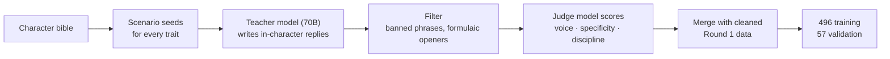
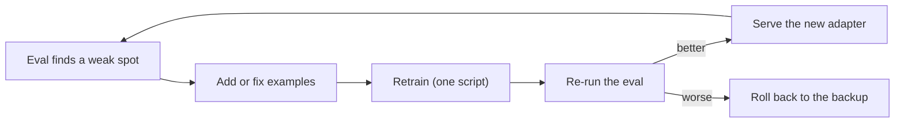
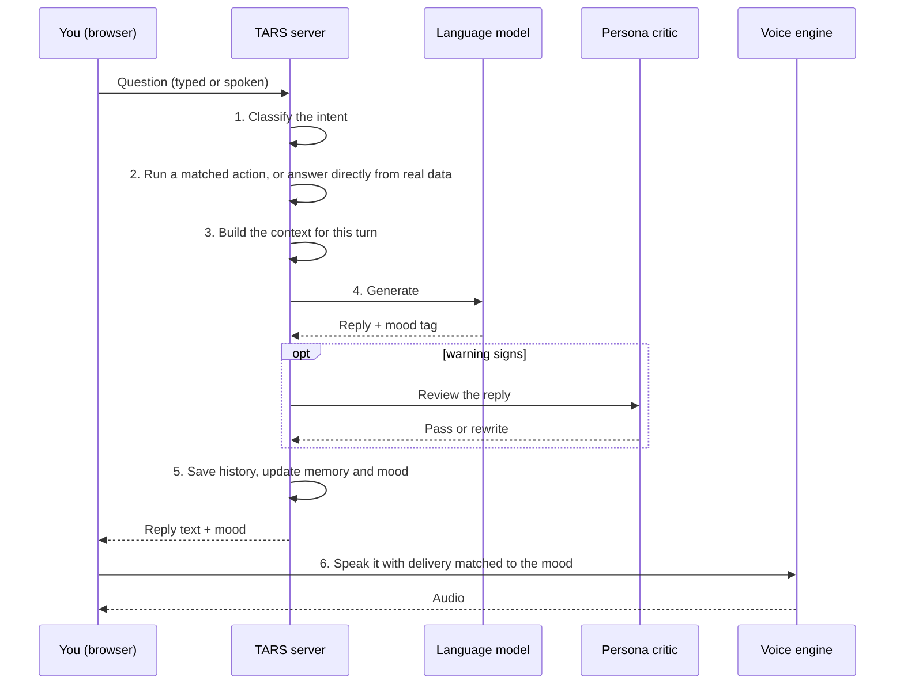
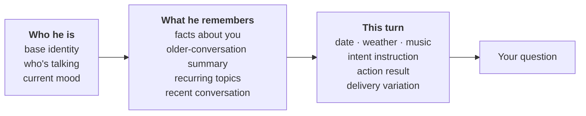
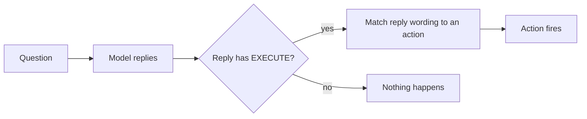
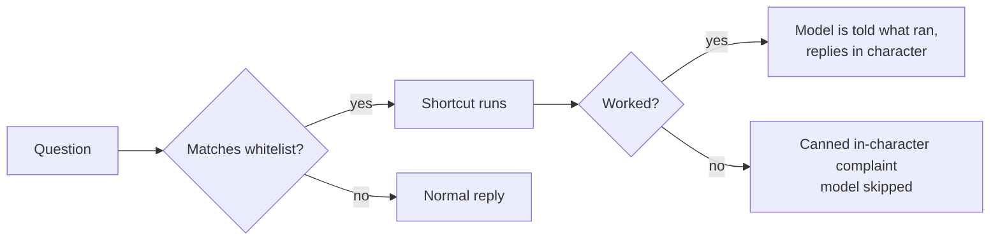
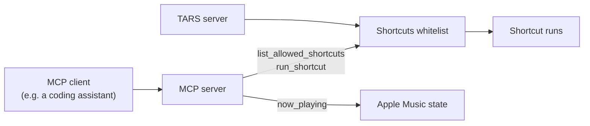

# OpenTARS

OpenTARS is my personal assistant, built to sound and act like TARS from *Interstellar*. Talk to him and he answers out loud, dry and a little annoyed that you asked. He'll also check the weather, put on a playlist, turn off the office lights, tell you how hard his CPU is working, and talk trash at you over a chess board.

It all runs on one Mac. No cloud. Every model I trained or ran for this used open weights on my own hardware, and I never paid for an API call.

Below is how it started, how the design and the architecture changed over time, and what I'd tell someone building something similar.

---

## Contents

1. [At a glance](#at-a-glance)
2. [What TARS can do](#what-tars-can-do)
3. [History of the design](#history-of-the-design)
   - [Starting point: one enormous prompt](#starting-point-one-enormous-prompt)
   - [Going standalone: giving it a memory](#going-standalone-giving-it-a-memory)
   - [Making the character stick](#making-the-character-stick)
   - [Hitting the ceiling](#hitting-the-ceiling)
4. [The turning point: fine-tuning with LoRA](#the-turning-point-fine-tuning-with-lora)
   - [Round 1: proof that it works](#round-1-proof-that-it-works)
   - [Round 2: writing the character down](#round-2-writing-the-character-down)
   - [Round 3: filling gaps and cleaning house](#round-3-filling-gaps-and-cleaning-house)
   - [Serving and retraining](#serving-and-retraining)
   - [What changed after](#what-changed-after)
5. [History of the architecture](#history-of-the-architecture)
   - [How TARS decides what to do](#how-tars-decides-what-to-do)
   - [The life of a request](#the-life-of-a-request)
   - [Step 1: Classify](#step-1-classify)
   - [Step 2: Act or answer directly](#step-2-act-or-answer-directly)
   - [Step 3: Build the context](#step-3-build-the-context)
   - [Step 4: Generate and check](#step-4-generate-and-check)
   - [Step 5: Remember](#step-5-remember)
   - [Step 6: Speak](#step-6-speak)
   - [How actions evolved](#how-actions-evolved)
   - [How the voice evolved](#how-the-voice-evolved)
   - [Matching the voice to the moment](#matching-the-voice-to-the-moment)
6. [Chess: a stress test](#chess-a-stress-test)
7. [What's next](#whats-next)
8. [What I learned](#what-i-learned)
9. [How I built it: AI-assisted development](#how-i-built-it-ai-assisted-development)
10. [Credit](#credit)

---

## At a glance

TARS began in early 2025 as a local model wearing one enormous character prompt, with a handful of actions it could trigger. It held up until somebody pushed on it. Later I rebuilt it as a standalone assistant with memory, mood, and state, and broke the prompt into layers after dozens of rounds of testing and fixing. Even big general-purpose models kept slipping out of character when pressed, so I fine-tuned a small one on a character bible I wrote, and that's what finally made him hold. The rest grew up around that: a voice that shifts with his mood, speech input, a whitelist of real actions around the house, an MCP server, and a chess board.

---

## What TARS can do

| Capability | How it works |
|---|---|
| **Hold a conversation in character** | A fine-tuned model with 13 moods (dry, frustrated, amused, sincere, reminiscing, and more) that also shape how the voice sounds |
| **Remember you** | Saved conversation history, long-term facts you ask him to remember (or forget), and a running summary of older conversations |
| **Know who's talking** | Keeps track of who is speaking and adjusts how he talks to each person |
| **Talk to other AIs** | Holds conversations directly with other assistants like ChatGPT and Claude, and knows they're AIs |
| **Play and report on music** | Starts playlists, skips, pauses, or picks something at random (weighted toward his favorite). Reads what's *actually* playing from Apple Music |
| **Control the house** | Lights, volume, Apple TV, the Mac's display and Bluetooth, and a robot vacuum room by room, all through a fixed list of approved macOS Shortcuts |
| **Check the weather** | Current conditions for home or any named city, from Open-Meteo (free, no key) |
| **Know the date and time** | Added only when the question is about time or scheduling |
| **Report on his own systems** | Live CPU, memory, disk, and uptime, and he can read his own error logs when you ask why something failed |
| **Explain how he works** | Answers questions about his own architecture using real facts about his own setup |
| **Hand off harder questions** | "Ask ChatGPT…" sends the question to ChatGPT through Apple Intelligence (no account or API key needed), then TARS delivers the answer in his own voice |
| **Flip coins and roll dice** | Settles small decisions on request |
| **Listen** | Local speech-to-text with a hands-free conversation mode |
| **Play chess** | A real, beatable game, with trash talk that reacts to how the game is going |

---

## History of the design

### Starting point: one enormous prompt

Version one was Llama 3.1 8B running in Ollama, with a system prompt describing who TARS is. The prompt grew. Every failure got a new paragraph, and before long it was past 1,100 lines. Buried in there were early versions of ideas I still use:

- **Keyword-triggered context.** When a question matched certain keywords, only the relevant background facts were added to the prompt. This was a hand-built form of retrieval, with no vector database involved.
- **Live facts.** Weather, headlines, and the current song were fetched and added only when the question called for them.
- **An action marker.** If TARS agreed to do something, his reply ended with `[EXECUTE]`, and the backend acted on it. If he refused in character, nothing happened.
- **Pre-computed randomness.** Coin flips and dice rolls were resolved in code *before* the model saw the question, so TARS always had a real result to announce.

Easy conversations went fine. Ask him who he was, insult him, or just keep talking for an hour, and the model's built-in helpful-assistant habits crept back with nothing to catch them. He had no memory either. Every session started from zero.

### Going standalone: giving it a memory

Next I pulled the project apart and rebuilt it as a standalone assistant. The first real architecture decision was putting a small server (`tars_server.py`) between the browser and the model, so that code decides exactly what the model sees on every turn. Everything below depends on that:

- **Conversation history** saved to disk, so TARS remembers you across sessions.
- **Mood.** Two values, patience and warmth, shift with how he's treated and slowly drift back toward baseline. When mood is far enough off, it colors his tone.
- **Recurring topics.** Subjects that come up repeatedly become "threads" he's aware of.
- **A user profile** of long-term facts he's agreed to remember, kept separate from the conversation log.
- **Speaker awareness.** He knows who is talking to him, including when it's another AI.

### Making the character stick

**Testing and fixing, 45 times.** Early on I built a loop. Run a batch of test questions, write down what broke, fix it, then check on the next run that the fix held. I went around it 45 times. A few favorites:

- TARS recited his own prompt instructions word for word.
- The prompt listed "wear a tiny hat" as an example of a silly request. TARS then brought up tiny hats in answers about *everything*. The fix worked, then the problem came back worse.
- "Who are you?" got the answer "No."

**From one prompt to layers.** One document was trying to define who he is, police his voice, handle every kind of request, and carry live facts, all at the same time. It couldn't. I split it into five layers that each do one thing:

1. **Base identity.** Short and fixed.
2. **Ambient context.** Real-world facts added *only* when the question needs them.
3. **Intent nudge.** A short instruction for this kind of request, placed *last* before the user's message, because the most recent instruction carries the most weight.
4. **Character notes.** Small random shifts in delivery on about a third of turns, so the same mood doesn't always sound identical.
5. **Drift correction.** Added only when the conversation starts sliding out of character.

When he kept repeating a phrase, my first move was to ban it. He'd switch to the nearest cousin of that phrase and repeat that instead. A wider spread of *good* examples to draw from fixed it, and that set the approach for everything after: fix the model and the prompt first, and patch the output only as a last resort.

### Hitting the ceiling

I'd been judging all of this by gut feel, and that stopped being good enough. So I wrote an eval suite with 100 prompts across 19 categories (identity, insults, sincere moments, debates, absurd requests, memory, and more) and had a script check every reply for assistant-speak, length, format, and category-specific failures. Then I pointed it at two big general-purpose models:

| | Gemma4 26B | Qwen 2.5 32B |
|---|---|---|
| Clean pass | 40% | 55% |
| Identity | 0/5 | 3/5 |
| Insults | 0/5 | 0/5 |
| Avg. reply length | 76 words | 57 words |

Ask Gemma's TARS who he was and you got "I am a large language model trained by Google." Both apologized when insulted. On sad questions they went soft and therapist-like. They could play the character in small talk and dropped it the moment a question had any weight, and I'd already been adding prompt for a long time. These numbers said more of it wasn't going to help.

---

## The turning point: fine-tuning with LoRA

So I stopped telling a big model how to act and trained a small one to *be* TARS.

I picked **Llama 3.2 3B Instruct**. It's quick on a Mac and runs well in Apple's MLX framework. It also doesn't cling to a corporate identity the way Gemma does. I was betting that a small model that had learned the character would beat a big one that spent every reply fighting its own training.

I used LoRA, which leaves the base model frozen and trains a small add-on next to it, called an adapter. In practice:

- **Training takes a few hours** on a Mac Studio, so I could still try a new version the same day.
- **The adapter is small and swappable.** After a bad run I just load the previous one.
- **The base model stays untouched**, so different character versions can be compared side by side.

| Setting | Value |
|---|---|
| Base model | Llama 3.2 3B Instruct, 4-bit (MLX) |
| Adapter | LoRA, rank 8, applied to 16 layers |
| Training | 600 iterations, batch size 2, learning rate 5e-5 |
| Hardware | One Mac Studio, peak memory about 17 GB |

### Round 1: proof that it works

The first adapter was trained on a few hundred example conversations, some written by hand and some generated and reviewed. On a 50-prompt test covering the same categories as the large-model eval:

| | Best large model | First fine-tuned 3B |
|---|---|---|
| Clean pass | 55% | **80%** |
| Identity | 3/5 | **5/5** |
| Insults | 0/5 | **5/5** |
| Avg. reply length | 57 words | **38 words** |

**A fine-tuned 3B model beat a general-purpose 32B model by 25 points.** It also started picking moods on its own, frustrated as well as dry. The base models had used dry almost every single time.

Round 1 also showed me the next problem. **Fine-tuning amplifies whatever is in the data.** Two lines showed up too often in the examples, "I've been reduced to a lamp switch" and a brag about calculating trajectories around a black hole, and he started reaching for them no matter what you asked. Ask for the lights and you got the lamp switch. A geography question somehow got it too. The data needed a real source of truth.

### Round 2: writing the character down

So before generating any more data, I wrote a character bible (`tars_canon.md`) and tagged every trait by how firm it is:

- **17 locked traits**, which are never negotiable. First person only. Honest about 90% of the time. Doesn't volunteer his backstory.
- **44 preferences.** Midnight blue is correct; neon pink is wrong. The Oxford comma is non-negotiable. Pineapple on pizza: unironic yes. *"A repair is a relationship; a replacement is a confession."*
- **Known drift.** Things the model has produced that must never become canon, like a book title that came out as a line of C# code.

Writing it forced me to get specific. "Has strong opinions" gives a model nothing to learn from, while "finds Comic Sans genuinely objectionable" gives it something to copy. A small script flags any locked trait that's missing from the live system prompt, so the bible and the prompt can't drift apart without me noticing.

Then the bible became a data pipeline:

```mermaid
flowchart LR
  C["Character bible"] --> P["Scenario seeds\nfor every trait"]
  P --> T["Teacher model (70B)\nwrites in-character replies"]
  T --> F["Filter\nbanned phrases, formulaic openers"]
  F --> J["Judge model scores\nvoice · specificity · discipline"]
  J --> M["Merge with cleaned\nRound 1 data"]
  M --> D["496 training\n57 validation"]
```

| Stage | What happened |
|---|---|
| Generate | A large 70B "teacher" model answered each scenario in character: 505 examples |
| Filter | Automatic checks plus a judge model cut 193 of them (38%) |
| Rank | Each survivor scored 1–10 on voice, specificity, and discipline |
| Clean old data | Round 1 examples re-checked. 31 dropped for memorized phrases. Others were dropped by the judge for being too therapist-like ("I'm so sorry to hear that. Losing someone close is never easy…") |
| Normalize | Every example's system prompt matched to the live one, so training looks like real use |

Having a judge score everything made the quality bar concrete. The top-scoring reply in the batch answered *"Monospace for content?"* with *"I use monospace for clarity, it's the sensible choice… anything else just introduces unnecessary flair"* and then stopped. The lowest-scoring reply that still made the cut was a soft, pleasant paragraph about midnight blue that any chatbot could have written.

The hard part was lines that *sounded* like TARS and made no sense coming from him. "I should have bought a Roomba instead" has the right sneer, but TARS didn't buy himself. "Who programmed this attitude?" assumes he's talking to his maker. I cut a lot of lines like that, and added delivery patterns to the bible so the data had something better to aim at: stepping back from sentiment after one sincere beat, being offended by the premise of a question, declining and immediately pivoting to something he *does* want to talk about.

### Round 3: filling gaps and cleaning house

Testing Round 2 showed where the data was thin, so I added targeted examples:

- **Refusals** across six categories that were nearly missing: emotional labor he doesn't owe, vague non-tasks ("fix my life"), requests to change who he is, demands for a false confession, undignified performances, and unreasonable relationship expectations. The pattern for all of them is a flat no, one short reason, then stop.
- **Rarer moods.** Curious had only 2 examples, far too few to learn from. Reminiscing got more too.
- **Delivery patterns** from the bible, each with its own examples: taking a request too literally, dignity offended by the question, the quick retreat from a sincere moment.
- **Insults**, the category that had failed on every base model.

All that took the training set to 718 examples, and a lot of it was repetitive. An audit flagged 97 near-duplicates plus a few replies that ran long. After one more cleanup pass I was down to **481 training and 58 validation examples**, a little smaller than Round 2's set but with the gaps filled in, and I retrained on that.

### Serving and retraining

The adapter can be served two ways, switched with one setting:

- **MLX (default):** the base model plus the adapter, applied live. Swap the adapter, restart, test.
- **Ollama (alternate):** the adapter merged into the model and converted to the common GGUF format.

You can't merge an adapter into a 4-bit model and export it in one step, and the docs don't make that obvious. It has to be expanded to full precision, exported, and then compressed back down. An Ollama model built without the right chat template was sneakier. It still runs, but it treats the conversation as plain text completion, and whatever answers you isn't TARS anymore.

Eventually I wrapped all of it in one script. It backs up the current adapter, trains, merges, exports, compresses, and registers the new model while I go do something else for a few hours. Trying a data change used to mean a pile of manual steps in the right order with the right flags, and now it's one command.

```mermaid
flowchart LR
  E["Eval finds a weak spot"] --> A["Add or fix examples"]
  A --> R["Retrain (one script)"]
  R --> T["Re-run the eval"]
  T -->|better| S["Serve the new adapter"]
  T -->|worse| B["Roll back to the backup"]
  S --> E
```

### What changed after

The fine-tune made him stable, but he still slips sometimes, so a few safeguards stayed:

- **Persona critic.** A long session of another AI assistant probing TARS surfaced failures that look grammatically fine: empty agreement turn after turn, "remembering" things that never happened, talking about "fine-tuning my demeanor." A second, smaller model now reviews risky replies and rewrites them if needed (see [Step 4](#step-4-generate-and-check)).
- **History hygiene.** A saved bad reply gets read back next session and teaches more bad replies, so history is cleaned of known bad patterns every time it loads.
- **Output filters turned off.** Before fine-tuning, a long list of text filters caught memorized phrases and assistant-speak on the way out. After Round 3, most of what they caught were false alarms, so they're **off by default**. For me that was the clearest evidence the fine-tune worked.

---

## History of the architecture

### How TARS decides what to do

TARS doesn't do tool calling. The model never decides to go get the weather or run a Shortcut. Plain Python makes that call before the model sees anything and runs the function itself. The model just gets the result, as text.

Take "what's the weather in Phoenix?":

1. **The server recognizes the question.** A pattern match flags it as a weather question and pulls out "Phoenix."
2. **The server fetches the forecast.** It calls the weather function directly, like any other Python code.
3. **The result goes into the model's context**, along with a short note on how to answer.
4. **The model writes the reply in character.** It never went looking for anything. It was handed the facts.

Actions, weather, diagnostics, what's playing, and the ChatGPT hand-off all work this way. That was deliberate. A 3B model is shaky at picking and calling tools, and I didn't want to debug one that confidently called the wrong thing or made up what came back. The cost is that I wire in every capability by hand, and TARS can't chain them together in ways I didn't plan. He'll tell you it's raining, but he won't decide on his own that rain makes it a good day to run the vacuum.

MCP is a different door entirely, for outside AI tools that want to reach some of the same capabilities. The TARS server never uses it.

### The life of a request

Every question goes through the same six steps, in this order:

```mermaid
sequenceDiagram
  participant U as You (browser)
  participant S as TARS server
  participant M as Language model
  participant C as Persona critic
  participant V as Voice engine

  U->>S: Question (typed or spoken)
  S->>S: 1. Classify the intent
  S->>S: 2. Run a matched action, or answer directly from real data
  S->>S: 3. Build the context for this turn
  S->>M: 4. Generate
  M-->>S: Reply + mood tag
  opt warning signs
    S->>C: Review the reply
    C-->>S: Pass or rewrite
  end
  S->>S: 5. Save history, update memory and mood
  S-->>U: Reply text + mood
  U->>V: 6. Speak it with delivery matched to the mood
  V-->>U: Audio
```

### Step 1: Classify

Before the model sees anything, plain code sorts the question into one of about 20 intents. The intent decides which context is added, which mood is required, and what short instruction goes last.

| Group | Intents |
|---|---|
| Conversation | greeting, identity, "how are you", opinion, debate, sincere, apology, insult, silly request, too short to understand |
| Character | humor setting, missing space, questions about his own architecture |
| Facts | weather, system diagnostics, ask ChatGPT |
| Actions | music, lights |
| Special | chess |

Some intents escalate with repetition. The third "who are you?" in a row doesn't get the same answer as the first. It gets a noticeably more tired one. Repeated insults push him from frustrated to angry. Repeated silly requests get shorter refusals.

### Step 2: Act or answer directly

Some questions never need the model to *decide* anything:

1. **Actions.** Your words are checked against the whitelist of approved Shortcuts. On a match, the Shortcut runs *now*, so the music starts before TARS says a word. The result goes into the context for Step 3. If it failed, TARS gives a canned in-character complaint about the plumbing, and the model is skipped so it can't invent an explanation.
2. **"What's playing?"** is answered straight from Apple Music's real state. The model can't invent a track title because it isn't involved.
3. **"Run diagnostics."** Real system numbers are formatted into a reply directly, with opinions attached ("CPU at 3%. The underutilization is almost insulting.").
4. **"Ask ChatGPT…"** sends the question through Apple Intelligence, and the answer is handed to TARS to deliver in his own voice.

**If the machine knows the answer, ask the machine, and let the model supply the voice.** That rule runs through the whole project.

### Step 3: Build the context

The model sees a stack of messages, and position matters. The closer an instruction sits to the question, the more weight it carries, so the stack runs from general to specific:

```mermaid
flowchart LR
  A["<b>Who he is</b><br/>base identity<br/>who's talking<br/>current mood"] --> B["<b>What he remembers</b><br/>facts about you<br/>older-conversation summary<br/>recurring topics<br/>recent conversation"]
  B --> C["<b>This turn</b><br/>date · weather · music<br/>intent instruction<br/>action result<br/>delivery variation"]
  C --> Q["Your question"]
```

Almost everything is **conditional**. Weather appears only for weather questions. The date appears only for time questions, because adding it every turn made TARS volunteer the date for no reason. Topics and personal facts are left out of debates, insults, sincere moments, and chess, where callbacks to your dog's name feel tone-deaf. If the last few replies already mentioned space, a note asks him to reach for something else this time.

### Step 4: Generate and check

The fine-tuned model writes the reply and tags it with a mood. Then:

- **Memory markers** in the reply (`[REMEMBER: …]`, `[FORGET: …]`) are pulled out and applied to his long-term facts.
- **The mood is enforced** where the intent requires it: grief gets sincere, an insult gets frustrated, whatever the model picked.
- **Light cleanup** removes stray tags and caps runaway length, with more room allowed for rants and sincere moments.
- **The persona critic** runs only when warning signs appear: a very short reply, stray non-English text, probing questions, a run of agreement, or a long session. It returns either "pass" or a rewrite. If it's slow or confused, the original goes through. Every decision is logged, which shows which failures are still real.

### Step 5: Remember

After replying, TARS updates what he knows:

- The exchange is **saved to history**.
- When history reaches 30 exchanges, older ones are **compressed into a running summary** and the latest 20 are kept word for word. That means long-term context without an ever-growing prompt.
- **Topics** are pulled from the exchange in the background, and repeated ones become threads.
- **Mood** shifts based on how he was treated, then decays back toward baseline over time.

### Step 6: Speak

The reply and its mood go back to the browser, which sends the text to the voice engine with voice settings for that mood (see [Matching the voice to the moment](#matching-the-voice-to-the-moment)). In conversation mode, the mic reopens as soon as he finishes speaking.

Voice input runs the other direction: **faster-whisper**, a local speech-to-text model, transcribes short phrases in under a second. The browser detects when you've stopped talking by measuring silence against the room's background noise.

### How actions evolved

The big question at each stage was *where the decision to act happens*.

| Generation | What triggers the action | What it fixed |
|---|---|---|
| **1. Model output** | TARS's reply includes `[EXECUTE]`, and the backend matches his wording to an action | — |
| **2. User input** | Your words are matched against a whitelist *before* the model replies | The model no longer has to phrase things just right, can't trigger the wrong action, and can't lie about what happened |
| **3. MCP** | The same whitelist exposed as a Model Context Protocol server | Any MCP-capable tool can list and run the same actions, with or without TARS running |

**Generation 1: the model's reply decides.**

The first version could switch named lighting themes ("blue" mapped to a theme, "red" to another), start playlists, and launch retro games by fuzzy-matching the title against a game library. If the model agreed, its reply ended with `[EXECUTE]`, and the backend matched the words in that reply to an action.

```mermaid
flowchart LR
  A["Question"] --> B["Model replies"] --> C{"Reply has EXECUTE?"}
  C -->|yes| D["Match reply wording to an action"] --> E["Action fires"]
  C -->|no| F["Nothing happens"]
```

This was fragile. The model had to phrase its reply in a way the matcher expected, without knowing what the matcher expected. And if the action failed, TARS had already said it was done.

**Generation 2: your words decide, before the model speaks.**

```mermaid
flowchart LR
  A["Question"] --> B{"Matches whitelist?"}
  B -->|yes| C["Shortcut runs"] --> D{"Worked?"}
  D -->|yes| E["Model is told what ran,<br/>replies in character"]
  D -->|no| F["Canned in-character complaint<br/>model skipped"]
  B -->|no| G["Normal reply"]
```

The whitelist grew well beyond music. It has 54 entries today:

| Area | What TARS can do |
|---|---|
| **Music** | 36 playlists by name, genre, or decade, plus pause, skip, and resume. "Play something" picks at random, weighted toward his favorite |
| **Volume** | Normal or low |
| **Apple TV** | Start watching, screensaver, sleep |
| **Lights** | Office lights, toggle all lights |
| **The Mac** | Sidecar, display white point, Bluetooth off |
| **Robot vacuum** | Clean everything or one room (bedroom, office, kitchen), send it home |

Matching runs in a fixed order: exact commands first ("stop," "skip," "resume"), then each entry's trigger phrases, then "play something," then a fuzzy match on "play X" against playlist names. Only after that is the model called. It gets a short note about what just ran, with guidance to acknowledge it in a line or two, a little differently each time.

The same generation added questions answered straight from real data instead of the model: what's playing, system diagnostics, weather, and "ask ChatGPT" (which is itself a Shortcut, routed through Apple Intelligence). See [Step 2](#step-2-act-or-answer-directly).

**Generation 3: the same whitelist, open to other tools.**

```mermaid
flowchart LR
  T["TARS server"] --> W["Shortcuts whitelist"]
  M["MCP client<br/>(e.g. a coding assistant)"] --> S["MCP server"]
  S -->|list_allowed_shortcuts<br/>run_shortcut| W
  S -->|now_playing| N["Apple Music state"]
  W --> R["Shortcut runs"]
```

The MCP server reads the same whitelist file and offers three tools: list what's allowed, run one entry by its ID, and report what's playing. Anything not on the list is refused, no matter what a client asks for. In practice this meant a coding assistant could test a new Shortcut directly, without TARS, the voice, or the model running at all.

Today, MCP only covers actions and what's playing. Weather, diagnostics, and the ChatGPT hand-off still live inside the TARS server and can't be reached over MCP yet (see [What's next](#whats-next)).

Nothing outside the whitelist can run, through either path. I made that call deliberately. Letting a model run anything on your machine is a different risk entirely, so TARS only gets the list I chose.

Running a Shortcut from a background process can hang silently on a permission prompt nobody sees. Launching it as a `shortcuts://` link instead returns immediately and runs as the logged-in user.

### How the voice evolved

| # | Voice engine | Result |
|---|---|---|
| 1 | macOS `say` | Instant, but flat: no range at all |
| 2 | Chatterbox (voice cloning) | Good voice, but memory climbed to 60–100+ GB over a long session. Fixed with three patches in a local fork |
| 3 | F5-TTS, custom-trained | Still needed a reference clip, which was the thing I was trying to get rid of |
| 4 | XTTS v2, fine-tuned | Closer voice, but too slow on Apple Silicon |
| 5 | Qwen3-TTS on MLX | The first voice that *performed*: delivery changes with TARS's mood |
| 6 ★ | Chatterbox, split across MLX and Metal | Current: about 2–3 seconds per reply |

The biggest speedup came from fixing how the voice reference clip was handled. It was being re-processed from scratch on every request. Processing it **once at startup** and reusing it removed most of the delay. The current engine also splits Chatterbox's two internal stages so each runs on the part of Apple Silicon it's fastest on, warms up at startup so the first reply isn't slow, and clears memory after every reply so it stays flat over long sessions.

The earlier version split long replies into sentences and voiced them one at a time to avoid dead air. After fine-tuning, replies average under 40 words, so the current engine voices each reply in one pass.

### Matching the voice to the moment

A good line read in the wrong voice still sounds wrong. A grudging concession shouldn't sound like a victory, and a sincere moment shouldn't have the same bite as an insult comeback. A lot of work went into making *how* TARS sounds follow *what* he's saying.

Every reply starts with one of 13 moods: dry, frustrated, angry, sincere, thoughtful, amused, tired, curious, reminiscing, conspiratorial, impressed, playful, or protective. The tag is stripped from the text before it's spoken, and it becomes the instruction for the voice.

The model picks a mood, but the server overrides it when the situation calls for something specific:

- Grief and sincere moments are always voiced as sincere, even if the model reached for dry.
- An insult gets frustrated. If he's already been frustrated recently and the insults keep coming, he moves to angry.
- Chess outcomes set the tone directly: pure gloating when he wins, a dry, grudging concession when he loses.
- His running mood (patience and warmth) shifts the default tone, so a rough conversation carries into the next reply.

Each mood has its own voice settings. Two dials do most of the work: *expressiveness* (how much energy and inflection goes into the delivery) and *anchoring* (how closely it sticks to TARS's base voice). They're tuned together. Turning up the energy on its own made loud moods sound wild and less like him, so the loudest moods are also held tightest to the base voice:

| Mood | Expressiveness | Anchoring | Sounds like |
|---|---|---|---|
| tired | 0.35 (lowest) | 0.45 | Drained, barely bothering |
| sincere | 0.40 | 0.45 | Softer, no sarcasm |
| dry | 0.45 | 0.50 | His default: understated bite |
| curious | 0.55 | 0.50 | Leaning in |
| playful | 0.70 | 0.50 | Banter, a smile in the voice |
| frustrated | 0.75 | 0.65 | Audibly fed up |
| angry | 0.90 (highest) | 0.75 | Cold, controlled, clipped |

On Qwen3-TTS, each mood was written as stage direction. That engine takes plain-language instructions, so every mood got a short director's note and its own speaking pace. Angry was *"controlled cold fury: clipped short sentences delivered like each one costs something, voice drops dangerously low and quiet on the most serious words."* Tired was *"weary, resigned… long exhale between thoughts, barely bothering,"* at 88% speed. Angry ran at 112%. Writing them forced me to define each mood precisely enough that a voice actor could perform it.

Chess exposed a register that doesn't fit any of the 13, the quiet satisfaction of a good move. For now it borrows amused, which is close but not right, so it's on the list for a new mood.

---

## Chess: a stress test

I assumed a fine-tuned model would be decent at chess. It was not. Once I pulled the problem apart there were three pieces, and the language model was the right tool for exactly one.

**1. The rules.** A chess library (chess.js) handles everything rule-based: legal moves, check and checkmate, stalemate and draws, castling, and promotion. The model never has to know the rules, because nothing it says can change the board.

**2. The moves.** TARS plays black, and his moves come from code. That code went through two versions:

| | First version | Current version |
|---|---|---|
| Approach | Score every legal move once | Search ahead with alpha-beta minimax |
| What it values | Captures, center squares, castling, a penalty for walking into check | Material plus piece-square tables (where each piece tends to be strongest) |
| Looks ahead | No | A few moves, trying captures first so the search stays fast |
| Variety | Random pick among the top three | Random pick among moves that score about the same |

The first version played like it was trying but made obvious mistakes. The current one plays a real game and can still be beaten.

**3. The commentary.** This is the part the model is good at, as long as it gets the right context. After a move, the game builds a short description for TARS:

- the move itself, what was captured, and whether it's check
- the last four moves on each side
- who's ahead on material
- how good the move was, measured by how much material changed hands

That last item sets the tone:

| What happened | How TARS reacts |
|---|---|
| You made a strong capture or trade | Genuine but reluctant acknowledgment |
| You blundered | Mocks it, a little smug |
| He won material | A bit smug about it |
| He blundered | Brushes it off, doesn't dwell |
| He checkmated you | Pure gloat |
| You checkmated him | Dry, grudging concession |

He doesn't comment on every move. He always reacts to checkmate, stalemate, check, promotion, castling, and losing a queen or rook. Minor pieces get a comment about 60% of the time, pawns about 25%, and quiet moves about 18%. He also mutters unprompted remarks, and you can talk to him mid-game. His own moves are always in first person, and he talks to you directly about yours.

Every chess message carries a tag, and the server gives it its own rules: one sentence, sound like someone sitting at the board, no chess lessons. The first version kept dragging in topics from earlier, unrelated conversations. Turning off topic memory and personal facts during a game fixed that right away, and it's the clearest example I have of something that holds for the whole project:

> **The model isn't the intelligence. The context you give it is.**

---

## What's next

What I'm planning to work on next:

- **Put more of TARS behind MCP.** Weather, diagnostics and logs, the ChatGPT hand-off, and coin flips and dice rolls (computed in code) should become MCP tools next to the actions, so any MCP client can use them.
- **One shared path for actions.** Right now the TARS server and the MCP server each have their own code for running a Shortcut. I want them sharing one, mostly so a fix only has to happen once.
- **Let the model choose, as an experiment.** Once those tools exist, I want to see whether a fine-tuned model can pick the right one by itself. The whitelist would still apply, and today's code-based routing stays as the fallback. It only takes over if it's just as reliable.
- **Close the character gaps I know about.** He needs the quiet-satisfaction mood that chess exposed. He also needs to get better at marking facts to remember. In testing the fine-tuned model didn't do that reliably, so memory leans on the server noticing when you say something about yourself ("my dog's name is Pepper").

---

## What I learned

1. **A system prompt is a costume. Fine-tuning is character.** The prompt held in small talk and came apart under pressure. Training changed what he does by default.
2. **Show, don't prohibit.** Banning a phrase just moved the problem next door. Better examples fixed it.
3. **Fine-tuning amplifies everything.** Two overused lines in Round 1's few hundred examples became his answer to everything. After that, every round's data got filtered hard before training.
4. **Measure early and write down the numbers.** In casual conversation, Gemma4 26B and Qwen 2.5 32B both seemed fine. On the 100-prompt eval they gave clean, in-character replies only 40% and 55% of the time, and neither handled a single insult in character.
5. **Specificity is the training signal.** Write the character down, in detail, before you train anything.
6. **Ground truth beats generation.** The model kept inventing song titles even with the real track sitting in its context. Answering "what's playing?" without the model was the only fix that stuck.
7. **Separate concerns.** Chess moves, action matching, and intent routing all live in plain code now. The model has one job, which is being TARS.
8. **Test where it runs.** My worst bugs only showed up on Apple Silicon, or when a background process did something I'd only ever tried from a terminal.
9. **Build the loop early.** Generate, judge, keep the best, drop the worst, retrain, repeat. Rounds 2 and 3 ran on that loop, and by the end I could switch off the output filters.

---

## How I built it: AI-assisted development

I built TARS with AI coding assistants in Cursor and VS Code, using Claude plugins and both OpenAI and Anthropic models. I designed the architecture and directed the work, one scoped change at a time.

| Language | Used for |
|---|---|
| **Python** | The TARS server, the voice engines, speech-to-text, the MCP server, and the whole training and eval pipeline |
| **HTML, CSS, and JavaScript** | The browser UI, voice input, and the chess game |
| **Bash** | One script to start and stop the whole stack, and one to retrain and redeploy the model |
| **AppleScript** | Reading what Apple Music is playing |
| **macOS Shortcuts** | Every action on the whitelist |
| **Ollama Modelfiles** | Packaging the fine-tuned model for Ollama |

A lot of my work on this project was context engineering, which means deciding what a model sees and what it's allowed to do with it.

**Inside TARS.** The runtime is context engineering from end to end. Each turn, the server chooses which facts, memories, and instructions go in and puts the most specific ones closest to the question. Anything likely to pull him off course stays out (see [Step 3](#step-3-build-the-context)). When he drifted, the fix was usually in what he was shown, like pulling topic memory out of chess games.

**In how I worked with the coding assistants.** The assistants wrote solid code, but they drifted past the edges of what I asked. I'd ask for one fix and sometimes get it plus changes I never wanted, because my instructions hadn't said where to stop. So I started writing prompts like specs, loosely following GitHub's [spec-driven development](https://github.blog/ai-and-ml/generative-ai/spec-driven-development-with-ai-get-started-with-a-new-open-source-toolkit/) approach, where a written spec is the source of truth and the work moves from specifying to planning to small tasks to implementation. Each prompt gave the purpose of the code and what already worked, then the exact change, anything that was off limits, and the point where the assistant should stop and check with me. For longer stretches of work I kept context documents the assistants could start from: a running project history, the character bible, and handoff notes I wrote before resetting a session that had grown too bloated to keep using. Those notes carried ground rules too, like "don't change working scripts unless I ask" and "investigate read-only first." A fresh session could pick up where the last one left off.

Taking that time up front made me a better developer. TARS had been showing me the same thing from the other side the whole time: whatever gap I left in the context, the model filled on its own.

---

## Credit

*Inspired by [GPTars](https://www.youtube.com/@gptars).*
*No poetry. No tiny hats.*
